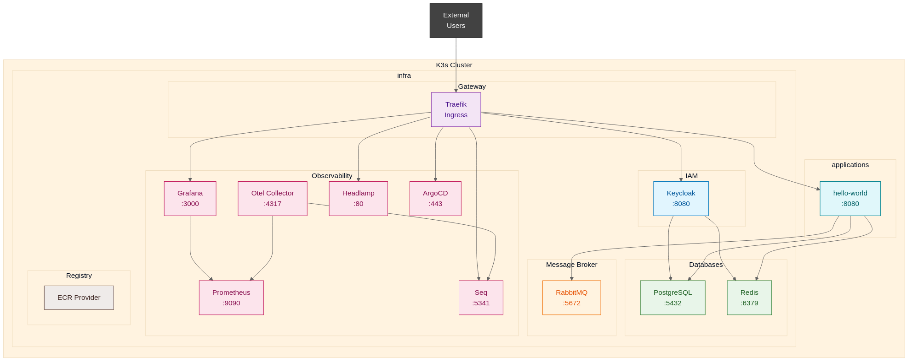

# K8s Cluster Manifests

This repository defines a Kubernetes cluster deployed via ArgoCD using the App-of-Apps pattern. It separates **services** (core infrastructure like databases, caching, message brokers) from **applications** (end-user interfaces and gateways).

## Cluster Architecture



See [docs/cluster-diagram.md](docs/cluster-diagram.md) for the full architecture diagram and service overview.

## Agentic Tools

This repository uses two agentic tools for managing changes and implementing features:

### OpenCode

An interactive CLI tool that helps with software engineering tasks. It can read, edit, and create files, run commands, and work with the codebase.

- **OpenCode**: https://opencode.ai/

### OpenSpec

A structured change management system that provides artifact-driven workflows for feature development. It tracks proposals, designs, specs, and tasks through a complete change lifecycle.

- **GitHub**: https://github.com/Fission-AI/OpenSpec

Changes are stored in `openspec/changes/` and organized in an `archive/` subdirectory when completed.

## Changes

### Recent Updates

- **2026-04-29**: Enabled Keycloak health endpoints at port 9000 so Kubernetes probes can succeed and the service becomes ready (`enable-keycloak-healthchecks`).
- **2026-04-29**: Automated creation of the Keycloak database during bootstrap so Postgres credentials stay in sync (`bootstrap-keycloak-db`).
- **2026-04-29**: Documented how to store GitHub credentials so ArgoCD can access private repos (`argocd-private-github-creds`).
- **2026-04-29**: Ensured Keycloak reuses PostgreSQL credentials for its database connection so the optimized image can authenticate (`align-keycloak-db-creds`).
- **2026-04-29**: Updated the Keycloak bootstrap env vars to use `KC_BOOTSTRAP_ADMIN_*`, matching the optimized image’s expectations (change: `align-keycloak-kc-bootstrap-vars`).
- **2026-04-29**: Added `scripts/setup-oauth-after-bootstrap.sh` and docs for rerunning Keycloak/Grafana/ArgoCD OAuth setup once the cluster is healthy (`setup-oauth-post-bootstrap`).
- **2026-04-28**: Ensured the Keycloak Bitnami bootstrap env vars point at the right secrets so the admin user comes up automatically (change: `align-keycloak-bootstrap-env`).
- **2026-04-28**: Updated the Keycloak IAM service manifest to use the optimized Bitnami image and documented the change (change: `update-keycloak-service`).
- **2026-04-28**: Removed placeholder image overrides from `config.yaml` and the bootstrap script so ArgoCD-manifests drive service images (change: `remove-config-image-placeholders`).
- **2026-04-27**: Removed the unused `hello-world` application from `infra/applications/` (change: `remove-hello-world-app`).
- **2026-04-27**: Updated `scripts/run-all.sh` so credential prompts remain the single source of truth, keeping exports aligned and never sourcing secrets from `config.yaml` (change: `validate-credentials-against-config`).
- **2026-04-27**: Ensured `scripts/run-all.sh` installs the `argocd` CLI automatically so diagnostics and troubleshooting commands work right after bootstrap (change: `install-argocd-cli`).
- **2026-04-14**: Added CoreDNS alias tracking for `auth.<domain>` so Keycloak tokens resolve internally.
- **2026-04-10**: Added Keycloak infra realm for service accounts and K3s OIDC auth
- **2026-04-10**: Replaced Portainer with Headlamp dashboard
- **2026-04-10**: Added K3s server configuration options in config.yaml
- **2026-04-10**: Added cluster config file (`config.yaml`) for centralized configuration
- **2026-04-10**: Added Keycloak as OIDC provider for K3s auth
- **2026-04-10**: Added Headlamp dashboard with Keycloak OIDC auth
- **2026-04-09**: Added run-all.sh script for automated bootstrap
- **2026-04-09**: Added ArgoCD auto-bootstrap from GitOps repository
- **2026-04-09**: Added Loki log aggregation service
- **2026-04-09**: Added OpenTelemetry collector
- **2026-04-08**: Added Grafana with Prometheus datasource
- **2026-04-08**: Added Prometheus metrics service
- **2026-04-08**: Added RabbitMQ message broker
- **2026-04-08**: Added Keycloak IAM service
- **2026-04-08**: Added PostgreSQL database
- **2026-04-08**: Added Redis cache

See `openspec/archive/` for all archived changes.

## Folder Structure

```
cluster-bootstrap/
├── bootstrap/
│   └── root-app.yaml           # Watches the /infra folder
└── infra/
    ├── services/               # Low-level platform services
    │   ├── databases/
    │   │   ├── postgres/
    │   │   └── redis/
    │   ├── gateway/
    │   │   ├── traefik.yaml
    │   │   ├── cert-manager.yaml
    │   │   └── external-dns.yaml
    │   ├── broker/
    │   │   └── rabbitmq/
    │   ├── iam/
    │   │   └── keycloak/
    │   └── observability/
    │       ├── prometheus/
    │       ├── grafana/
    │       ├── loki/
    │       ├── opentelemetry/
    │       └── headlamp/
    │
    └── applications/           # End-user applications
```

## Directory Reference

| Directory             | Description                                                             |
| --------------------- | ----------------------------------------------------------------------- |
| `infra/services/`     | Core infrastructure (databases, caching, messaging, IAM, observability) |
| `infra/applications/` | User-facing applications deployed on top of services                    |

## Repository URL Configuration

The `bootstrap/root-app.yaml` file uses `repoURL` to specify where ArgoCD should pull manifests from. Update this value based on your deployment environment:

### Local Testing

```yaml
repoURL: file:///home/ernesto/Repository/Cluster/k8s
```

### Remote Git Repository

```yaml
repoURL: https://github.com/<your-username>/k8s.git
# Or for SSH
repoURL: git@github.com:<your-username>/k8s.git
```

### Local Git Server

```yaml
repoURL: http://localhost:8080/k8s.git
```

## Quick Start - Automated Bootstrap

The easiest way to set up the cluster is using the `make` targets. The full flow is:

```bash
# 1. Bootstrap K3s and kubectl
make bootstrap

# 2. Install ArgoCD
make install-argocd

# 3. Run full service bootstrap (secrets, ArgoCD sync, Keycloak setup)
make services

# 4. After ArgoCD has synced all services, run the post-install sequence:
#    - Configures Keycloak OAuth clients (Grafana, ArgoCD, Headlamp)
#    - Patches Traefik IngressRoute hostnames to match config.yaml domain
make post-install

# Or run each step individually:
make setup-oauth          # Keycloak OAuth clients only
make setup-routes         # IngressRoute hostname patching only
make setup-routes ARGS="--verify-only"   # Check current route state
make setup-routes ARGS="--dry-run"       # Preview changes without applying
```

### Prerequisites

- Linux host (Ubuntu, Debian, CentOS, etc.)
- Root/sudo access
- Internet connection
- Git clone of this repository

### What `make services` Does

1. **Installs K3s** - Creates Kubernetes cluster
2. **Installs ArgoCD** - GitOps deployment tool
3. **Prompts for credentials** - Secure input for all service passwords
4. **Creates Kubernetes secrets** - Stores credentials in `infra` namespace
5. **Applies root-app.yaml** - Triggers ArgoCD to deploy all services
6. **Configures Keycloak clients** - Creates OIDC clients for Grafana and ArgoCD automatically
7. **Polls for health** - Waits until all services are healthy (timeout: 5 minutes)

The bootstrap script installs the `argocd` CLI (`/usr/local/bin/argocd`) if it is missing. Override the downloaded version with `ARGOCD_CLI_VERSION` if needed.

Image tags are defined directly in the ArgoCD-managed manifests. Update those manifests instead of `config.yaml` when you need to change versions.

### Accessing Services

#### Via Traefik (HTTPS, Let's Encrypt — after `make setup-routes`)

Routes are defined by `routes.*` prefixes in `config.yaml` combined with `cluster.domain`. Run `make setup-routes` after the cluster is up to patch the live IngressRoutes.

| Service  | URL                          | Notes                          |
| -------- | ---------------------------- | ------------------------------ |
| ArgoCD   | `https://argocd.staraps.com` | GitOps UI                      |
| Grafana  | `https://grafana.staraps.com`| Metrics & dashboards           |
| Headlamp | `https://infra.staraps.com`  | Kubernetes dashboard (OIDC)    |
| Keycloak | `https://auth.staraps.com`   | IAM / SSO admin console        |

> Domain and subdomain prefixes are configured in `config.yaml` under `cluster.domain` and `routes.*`.
> The IngressRoute YAML files ship with `*.mydomain.com` as a safe default so ArgoCD applies them
> without errors. Run `make setup-routes` to patch them to your real domain.

#### Via NodePort (direct internal network access)

These ports are accessible directly on the node IP without going through Traefik:

| Service      | NodePort | Protocol | Notes                                |
| ------------ | -------- | -------- | ------------------------------------ |
| PostgreSQL   | `30432`  | TCP      | Direct DB access from internal network |
| Redis        | `30379`  | TCP      | Direct cache access                  |
| ArgoCD       | `30080`  | HTTP     | ArgoCD server (unauthenticated port) |
| Headlamp     | `30466`  | HTTP     | Kubernetes dashboard                 |
| Traefik HTTP | `30618`  | HTTP     | Traefik entrypoint (web)             |
| Traefik HTTPS| `32084`  | HTTPS    | Traefik entrypoint (websecure)       |

#### Via `kubectl port-forward` (local dev access)

```bash
# ArgoCD UI
kubectl port-forward svc/argocd-server -n argocd 8080:8080
# Open http://localhost:8080 - Username: admin

# Keycloak Admin Console
kubectl port-forward svc/keycloak -n infra 8080:8080
# Open http://localhost:8080 - Username: admin

# Headlamp
kubectl port-forward svc/headlamp -n infra 4466:80
# Open http://localhost:4466 - Use service account token

# Grafana
kubectl port-forward svc/grafana -n infra 3000:3000
# Open http://localhost:3000
```

### Quick Start - Manual Setup

If you prefer to set up manually (or need more control), follow these steps:

#### Prerequisites

- Linux host (Ubuntu, Debian, CentOS, etc.)
- Root/sudo access
- Internet connection

#### Installation

1. **Install K3s** (creates Kubernetes cluster):

   ```bash
   ./scripts/bootstrap.sh
   ```

2. **Install ArgoCD** (GitOps deployment tool):

   ```bash
   ./scripts/install-argocd.sh
   ```

3. **Access ArgoCD UI**:

   ```bash
    kubectl port-forward svc/argocd-server -n argocd 8080:8080
   ```

   Then open http://localhost:8080 in your browser.
   - **Username**: `admin`
   - **Password**: Use the password shown during installation

#### Notes

- Both scripts are idempotent - safe to run multiple times
- K3s data is at `/var/lib/rancher/k3s`
- To uninstall K3s: `curl -sfL https://get.k3s.io | sh -s - --uninstall`

## K3s Server Configuration

K3s can be customized via `config.yaml` before installation. The following options are available:

### Configuration Options

```yaml
k3s:
  # Disable embedded components (traefik, servicelb, etc.)
  disable: []
  # Additional K3s server flags
  serverFlags: []
```

The `cluster.domain` in config.yaml (default: `cluster.local`) is used for both:

- Kubernetes cluster domain (for service DNS)
- K3s `--cluster-domain` flag (applied automatically during install)

### Available Disable Options

| Option           | Description                                     |
| ---------------- | ----------------------------------------------- |
| `traefik`        | Disable the built-in Traefik ingress controller |
| `servicelb`      | Disable the built-in ServiceLB load balancer    |
| `local-storage`  | Disable the built-in local storage driver       |
| `metrics-server` | Disable the built-in metrics server             |

### Example: Disable Traefik

```yaml
k3s:
  disable:
    - traefik
```

### Example: Custom Server Flags

Any K3s server flag can be passed via `serverFlags`. Common examples:

```yaml
k3s:
  serverFlags:
    - "--disable-cloud-controller"
    - "--kube-controller-manager-arg=bind-address=0.0.0.0"
    - "--etcd-extra-args=quota-backend-bytes=8589934592"
```

Common K3s server flags:

- `--disable-cloud-controller` - Disable Kubernetes cloud controller
- `--disable-network-policy` - Disable K3s default network policy
- `--write-kubeconfig-mode` - Set kubeconfig permissions (e.g., "644")
- `--kube-controller-manager-arg` - Custom kube-controller-manager args
- `--kube-scheduler-arg` - Custom kube-scheduler args
- `--etcd-extra-args` - Custom etcd arguments

### Single Node vs HA Cluster

This repository currently deploys a **single-node K3s cluster** by default, suitable for:

- Development and testing
- Small workloads
- Learning Kubernetes

#### What's Required for HA Cluster

To create a highly available cluster with multiple control planes and workers:

**Control Plane (Server Nodes):**

- **Minimum 3 servers** for embedded etcd (odd number required for quorum)
- Or **2+ servers** with external database (PostgreSQL/MySQL)
- All servers need pre-shared network access
- First server initializes cluster, others join via token

**Worker Nodes:**

- Can be added after control plane is ready
- Join via token from any control plane node

**Steps to convert to HA:**

1. Initialize first control plane with `--cluster-init` flag
2. Generate join token: `k3s token create`
3. On additional servers: `curl -sfL https://get.k3s.io | INSTALL_K3S_EXEC="server --token=<token>" sh -`
4. Add workers: `curl -sfL https://get.k3s.io | K3S_URL=https://<control-plane>:6443 K3S_TOKEN=<token> sh -`

**Note:** This repository's bootstrap scripts don't currently support multi-node deployment. Custom scripts would be needed.

## Traefik Configuration

K3s ships with Traefik as the default ingress controller. This repo includes manifests for TLS certificate management.

### Let's Encrypt Setup

The cluster uses a centralized `config.yaml` file for non-sensitive values. Before deploying:

1. Edit `config.yaml` in the repository root
2. Set `traefik.email` to your actual email address
3. Optionally customize `cluster.domain`; image tags are defined in the ArgoCD manifests and are not part of `config.yaml`

```yaml
cluster:
  domain: cluster.local

traefik:
  email: admin@example.com
```

The `run-all.sh` script will automatically use these values when deploying.

### Middlewares Available

- `redirect-http-to-https` - Redirects HTTP to HTTPS
- `security-headers` - Adds security headers (X-Frame-Options, X-Content-Type-Options, etc.)
- `rate-limit` - Rate limiting (100 req/s average, 50 burst)
### Keycloak auth alias

Services validate tokens faster when `auth.<cluster-domain>` resolves to the internal Keycloak IP. Set `cluster.hostIP` in `config.yaml` to match the Keycloak service ClusterIP (`kubectl get svc keycloak -n infra -o jsonpath='{.spec.clusterIP}'`).

- The bootstrap script (`scripts/services.py`) reads this value, writes `<cluster.hostIP> auth.<cluster-domain>` into `/etc/coredns/NodeHosts`, and restarts CoreDNS to apply the alias.
- `infra/services/registry/coredns-config.yaml` seeds the GitOps-managed CoreDNS `ConfigMap` with the same entry. Update that file whenever `cluster.hostIP` changes so the git repo and runtime are in sync.

If you change `cluster.domain`, update the alias entry in `infra/services/registry/coredns-config.yaml` and rerun the bootstrap script so `/etc/coredns/NodeHosts` reflects the new hostname.

## Service Connection Details

Internal service endpoints accessible within the cluster:

| Service       | DNS Name                                          | Port | Namespace |
| ------------- | ------------------------------------------------- | ---- | --------- |
| PostgreSQL    | `postgres.infra.svc.cluster.local`                | 5432 | infra     |
| Redis         | `redis.infra.svc.cluster.local`                   | 6379 | infra     |
| RabbitMQ      | `rabbitmq.infra.svc.cluster.local`                | 5672 | infra     |
| Prometheus    | `prometheus.infra.svc.cluster.local`              | 9090 | infra     |
| Grafana       | `grafana.infra.svc.cluster.local`                 | 3000 | infra     |
| Keycloak      | `keycloak.infra.svc.cluster.local`                | 8080 | infra     |
| ArgoCD        | `argocd-server.argocd.svc.cluster.local`         | 8080 | argocd    |
| OpenTelemetry | `opentelemetry-collector.infra.svc.cluster.local` | 4317 | infra     |
| Loki          | `loki.infra.svc.cluster.local`                    | 3100 | infra     |

**Note:** Loki and OpenTelemetry are complementary:

- **Loki**: Log aggregation and storage
- **OpenTelemetry**: Traces and metrics collection (can also forward logs to Loki)

Together they provide full observability (logs + metrics + traces).
| Headlamp | `headlamp.infra.svc.cluster.local` | 80 | infra |

### Connection Examples

**PostgreSQL:**

```bash
# From another pod in the cluster
psql -h postgres.infra.svc.cluster.local -p 5432 -U postgres -d postgres
```

**Redis:**

```bash
# From another pod in the cluster
redis-cli -h redis.infra.svc.cluster.local -p 6379
```

**RabbitMQ:**

```bash
# From another pod in the cluster
# AMQP port 5672, Management UI at 15672
amqp-connect -h rabbitmq.infra.svc.cluster.local -p 5672
```

**Prometheus (internal):**

```bash
# From another pod in the cluster
curl http://prometheus.infra.svc.cluster.local:9090
```

**Grafana (internal):**

```bash
# From another pod in the cluster
curl http://grafana.infra.svc.cluster.local:3000
```

**Keycloak (internal):**

```bash
# From another pod in the cluster
curl http://keycloak.infra.svc.cluster.local:8080
```

### Notes

- Both PostgreSQL and Redis are configured with ClusterIP services (internal only)
- Secrets are stored in `infra` namespace - update passwords before production use
- Storage is persistent via PersistentVolumeClaim

## Managing Secrets

Secrets use environment variable placeholders that are replaced during deployment:

| Service    | Secret File          | Environment Variable                                    |
| ---------- | -------------------- | ------------------------------------------------------- |
| PostgreSQL | postgres-secret.yaml | `POSTGRES_PASSWORD` (also used by Keycloak; bootstrap now creates the `keycloak` database) |
| Redis      | redis-secret.yaml    | `REDIS_PASSWORD`                                        |
| RabbitMQ   | rabbitmq-secret.yaml | `RABBITMQ_DEFAULT_USER`, `RABBITMQ_DEFAULT_PASS`        |
| Prometheus | -                    | -                                                       |
| Grafana    | grafana-secret.yaml  | `GRAFANA_OIDC_CLIENT_SECRET`, `GRAFANA_ADMIN_PASSWORD`  |
| Keycloak   | keycloak-secret.yaml | `KEYCLOAK_ADMIN_PASSWORD`, `KC_BOOTSTRAP_ADMIN_USERNAME`, `KC_BOOTSTRAP_ADMIN_PASSWORD` |
| Headlamp   | -                    | - (uses service account token)                          |

`scripts/services.py` collects these secrets interactively via `prompt_secrets()` and expects you to type them or export them before running the script. Do not store these credentials in `config.yaml` to avoid leaking secrets into the repository history.

## Recovering OAuth Setup

If the bootstrap run stops when Keycloak or PostgreSQL are unavailable, run the recovery steps after the cluster and database pods become healthy:

```bash
make setup-oauth   # Recreates Keycloak realm, clients, and K8s secrets
make setup-routes  # Re-patches Traefik IngressRoute hostnames
```

### Setting Passwords

Before deploying, set the password by exporting the environment variable:

```bash
# For PostgreSQL
export POSTGRES_PASSWORD="your-secure-password"

# For Redis
export REDIS_PASSWORD="your-secure-password"

# For RabbitMQ
export RABBITMQ_DEFAULT_USER="your-secure-user"
export RABBITMQ_DEFAULT_PASS="your-secure-password"

# For Grafana
export GRAFANA_OIDC_CLIENT_SECRET="your-secure-client-secret"
export GRAFANA_ADMIN_PASSWORD="your-secure-password"

# For Keycloak
export KEYCLOAK_ADMIN_PASSWORD="your-secure-password"
export KC_BOOTSTRAP_ADMIN_USERNAME="admin"
export KC_BOOTSTRAP_ADMIN_PASSWORD="your-secure-password"
# The Keycloak database password is the same as $POSTGRES_PASSWORD (bootstrap script creates the database automatically)
```

Then update the secret file with the actual password or use a tool like `envsubst` to replace the placeholder during deployment.

### Verifying OAuth clients

1. **Grafana** – `kubectl port-forward svc/grafana -n infra 3000:3000`, open `http://localhost:3000`, click the **Keycloak** login option, and ensure the browser redirects to your Keycloak realm and permits a successful sign-in.
2. **ArgoCD** – `kubectl port-forward svc/argocd-server -n argocd 8080:8080`, visit `http://localhost:8080`, and choose the external OAuth login; you should be redirected to Keycloak and granted access after authentication with a user in `argocd-admins`.
3. **Headlamp** – `kubectl port-forward svc/headlamp -n infra 4466:80`, generate a token with `kubectl create token headlamp -n infra`, paste it into the Headlamp login prompt, and confirm the UI loads without authentication errors.

## Pre-Deployment Checklist

Before deploying services, ensure the following are configured:

- [ ] **DNS**: `argocd.<domain>`, `grafana.<domain>`, `auth.<domain>`, and `infra.<domain>` point to your cluster's external IP (subdomain prefixes are set via `routes.*` in `config.yaml`)
- [ ] **Let's Encrypt**: Email configured in `config.yaml`
- [ ] **Secrets**: All passwords set in respective secret files
- [ ] **Keycloak Client**: Grafana and ArgoCD OIDC clients configured in Keycloak master realm
- [ ] **PostgreSQL**: Running and accessible before deploying Keycloak
- [ ] **Prometheus**: Running before deploying Grafana (for datasource)

## Keycloak Configuration

All services that use Keycloak for authentication (Grafana, ArgoCD, etc.) are configured to use the **master realm**.

### Existing Clients

- **Grafana**: OIDC client for Grafana authentication
- **ArgoCD**: OIDC client for ArgoCD authentication (PKCE enabled)

### Groups

Create the following groups in the master realm:

- `argocd-admins` - Users in this group get admin access to ArgoCD
- `grafana-admins` - Users in this group get admin access to Grafana
- `grafana-editors` - Users in this group get editor access to Grafana

### ArgoCD Keycloak Client Setup

1. Create a new client in Keycloak (master realm)
2. Client ID: `argocd`
3. Client Protocol: `openid-connect`
4. **Disable** Client Authentication (use PKCE)
5. Valid Redirect URIs: `https://argocd.mydomain.com/auth/callback`
6. Web Origins: `https://argocd.mydomain.com`
7. Add client scope for groups with Token Mapper (Group Membership)
8. Create `argocd-admins` group and add admin users

## ArgoCD Repository Credentials

ArgoCD stores Git repository credentials in secrets within the `argocd` namespace. To let ArgoCD pull from private GitHub repositories, create a secret such as:

```bash
kubectl create secret generic argocd-private-github \
  -n argocd \
  --from-literal=username=git \
  --from-literal=password="<github-pat>" \
  --dry-run=client -o yaml | kubectl apply -f -
```

Limit the token scope to the minimum required (`repo` read access) and rotate it by re-running the command with a new PAT. Update the ArgoCD repository manifest (e.g., `infra/services/observability/argocd/argocd-cm.yaml`) so the entry for the private repo points at `argocd-private-github` and does not inline credentials.

### Keycloak Health Checks

Keycloak now exposes `/health/live`, `/health/ready`, and `/health/started` on port `9000` once you set `KC_HEALTH_ENABLED=true`, `KC_HTTP_ENABLED=true`, `KC_METRICS_ENABLED=true`, and `KC_PROXY_HEADERS=xforwarded`. The deployment’s probes rely on those endpoints so Kubernetes marks the pod as Ready only after the Bitnami runtime reports health.

## Kube-Score Validation

All manifests are validated using [kube-score](https://github.com/zegl/kube-score) to ensure security best practices.

### Run Validation

```bash
# Install kube-score
go install github.com/zegl/kube-score/cmd/kube-score@latest

# Run against all service manifests
kube-score score \
  infra/services/observability/loki/loki-statefulset.yaml \
  infra/services/observability/promtail/promtail-daemonset.yaml \
  infra/services/observability/prometheus/prometheus-deployment.yaml \
  infra/services/observability/grafana/grafana-deployment.yaml \
  infra/services/observability/opentelemetry/opentelemetry-deployment.yaml \
  infra/services/observability/headlamp/headlamp-deployment.yaml \
  infra/services/databases/postgres/postgres-statefulset.yaml \
  infra/services/databases/redis/redis-statefulset.yaml \
  infra/services/broker/rabbitmq/rabbitmq-statefulset.yaml \
  infra/services/iam/keycloak/keycloak-deployment.yaml
```

### Security Standards Applied

All workloads include:

- **Security Context**: `runAsNonRoot: true`, `runAsUser: 10001`, `runAsGroup: 10001`, `fsGroup: 10001`, `readOnlyRootFilesystem: true`
- **Image Pull Policy**: `imagePullPolicy: Always`
- **Resource Limits**: CPU, memory, and ephemeral-storage limits
- **Liveness/Readiness Probes**: Different probes for different services

### Known Warnings (Non-Critical)

- **NetworkPolicy**: Not implemented (intentional for single-node K3s)
- **Loki StatefulSet ServiceName**: kube-score false positive - serviceName is correctly set
