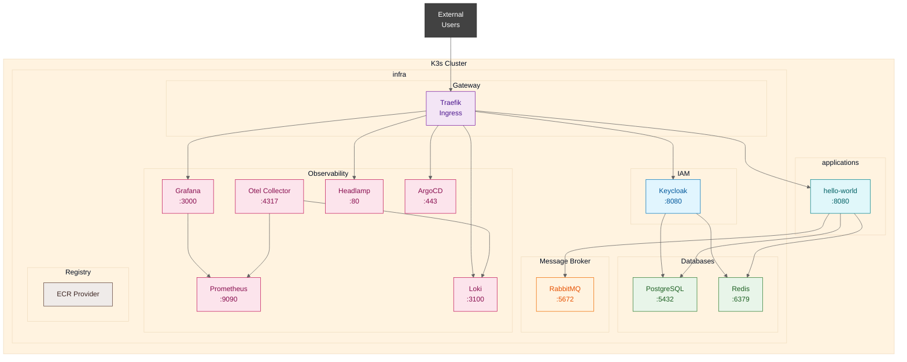

# Cluster Architecture Diagram

## Service Overview

| Category | Service | Port | Type | Purpose |
| -------- | -------- | ---- | ---- | ------- |
| **Databases** | PostgreSQL | 5432 | ClusterIP | Primary database |
| | Redis | 6379 | ClusterIP | Cache store |
| **Broker** | RabbitMQ | 5672/15672 | ClusterIP | Message broker |
| **IAM** | Keycloak | 8080 | ClusterID | Identity provider |
| **Observability** | Prometheus | 9090 | ClusterIP | Metrics |
| | Grafana | 3000 | ClusterIP | Visualization |
| | Loki | 3100 | ClusterIP | Log aggregation |
| | OpenTelemetry | 4317 | ClusterIP |Tracing |
| | Headlamp | 80 | ClusterIP | K8s UI |
| | ArgoCD | 443 | ClusterIP | GitOps |
| **Gateway** | Traefik | 80/443 | LoadBalancer | Ingress |
| **Registry** | ECR Provider | - | DaemonSet | AWS ECR auth |

## Deployment Order

1. **Databases** (PostgreSQL, Redis)
2. **Broker** (RabbitMQ)
3. **Gateway** (Traefik)
4. **IAM** (Keycloak)
5. **Observability** (Prometheus, Grafana, Loki, OpenTelemetry, Headlamp, ArgoCD)
6. **Registry** (ECR Credential Provider)
7. **Applications** (hello-world)